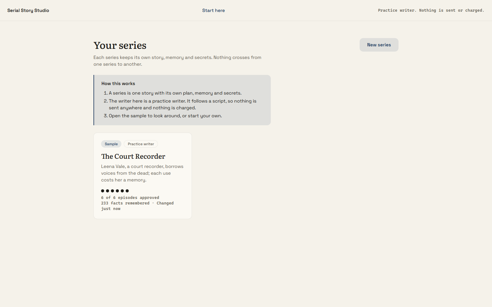
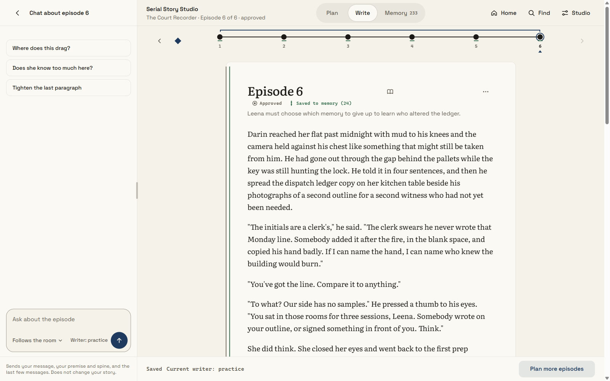
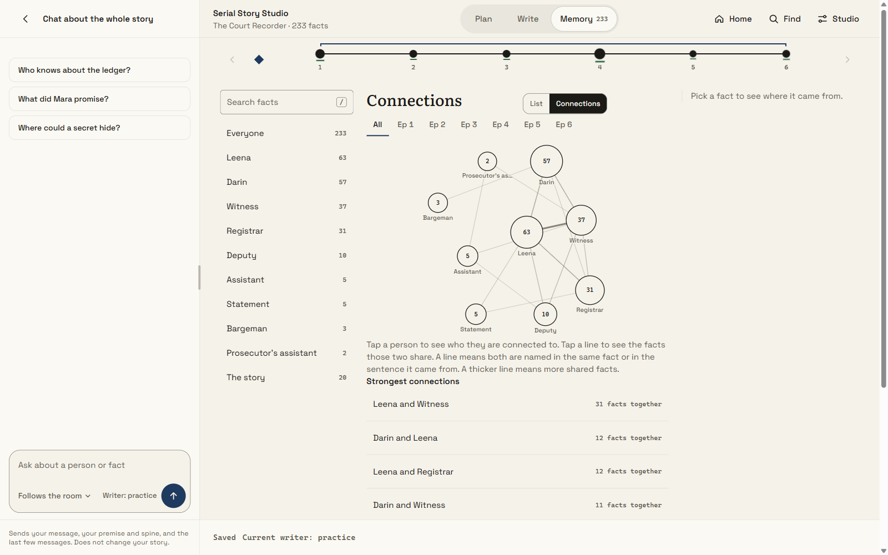
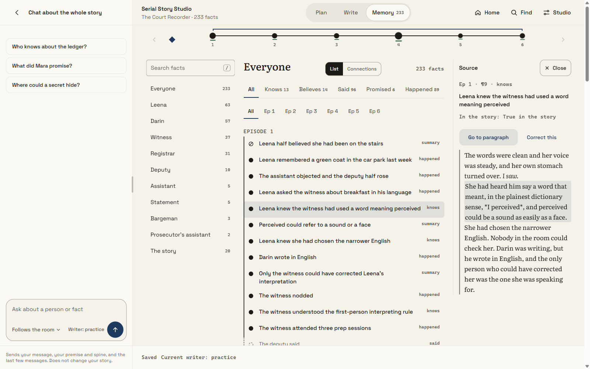
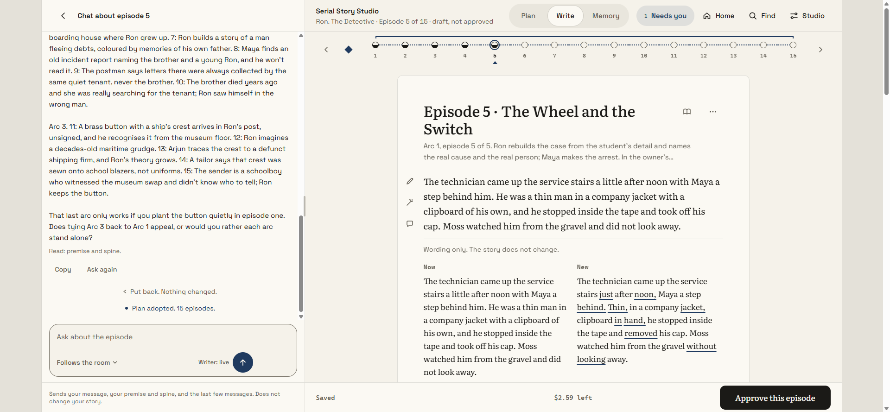
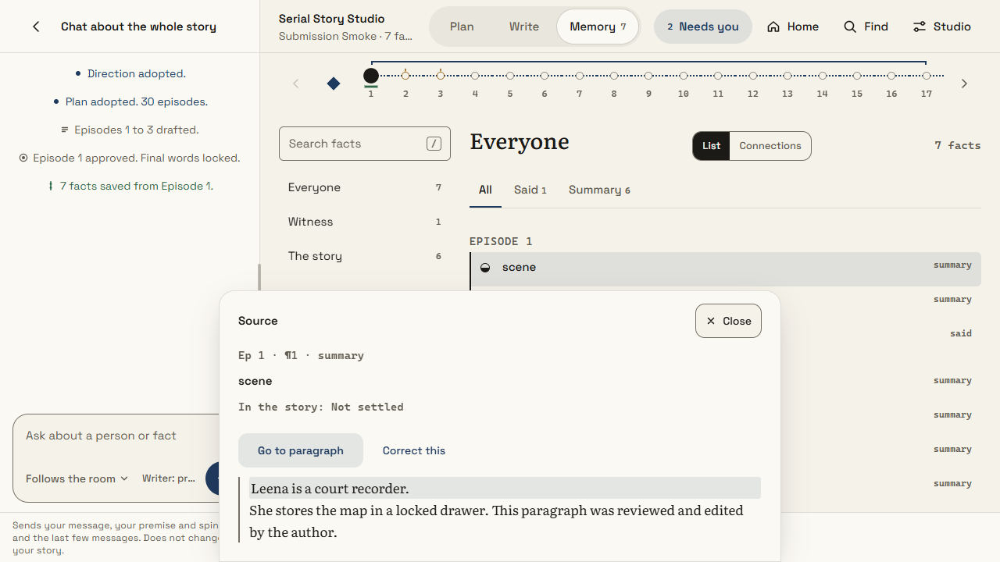

# Ayan Das | Serial Story Studio

Code and development overview, 8 October 2026. This package lets you inspect the implementation, run the app and see what has been verified versus what is still unfinished. Start with `REVIEWER-GUIDE.md` for the logic, a short walkthrough and the implementation status.

## Start in five minutes
1. Open the included `source` folder. The app launchers and instructions are included in `source`.
2. With Python 3.14 installed, run `python try_it.py --open` inside that folder, or double-click `try-it.bat` on Windows.
3. The practice desk opens at http://127.0.0.1:8766/. No API key, package installation or payment is needed. Use the sample story or create a new series.
4. Adopt a direction and plan, draft, edit/save, approve, then save the proposed story facts. The included recording uses the free scripted writer, not real generation.
5. The source README explains optional live generation using a Merge key. For live evaluation, use the key supplied separately with the review email; no credential is stored here. Live calls cost money; the existing 15-episode prose is readable without making any calls.

## Read order
- `REVIEWER-GUIDE.md`: how to test, overall logic, implemented features and unfinished work.
- `LIVE-EVALUATION.md`: where to put the supplied key, live launch steps and adjustable episode length.
- `DESIGN-VISION.md`: human-in-the-loop rationale, LLM-assisted development and current backend boundaries.
- `DEVELOPMENT-OVERVIEW.md`: current scope, progression and read order.
- `report/index.html`: illustrated development report, bundled with its screenshots. Open it locally in a browser.
- `DECISIONS.md`: current design and what breaks at scale.
- `DELIVERABLES.md`: exact assignment coverage and gaps.
- `demo/ron-the-detective/`: 15 actual saved drafts, direction and 15-entry plan. No story database or private author notes.
- `demo/the-tide-ledger/`: 100-entry plan, 10 approved episodes, episode 11 as an unapproved draft, and the independent literary review.
- `demo/feedback-evidence.md`: saved author edits and evidence of inclusion in later writer context, with limits stated.
- `verification/`: fresh automated and browser smoke results and recording, when available.
- `source/`: sanitized current application source. The snapshot excludes the working repository's private local state.

This is a local browser app plus an author CLI, not a public hosted deployment. No public URL or seven-day hosting claim is made. Live generation quality, billing/recovery under real failures, physical devices and 200-episode behavior were not independently retested for this submission.

The original development checkout passed 354 tests. Fresh publication verification is recorded in `verification/publication-tests.txt`. Free practice mode is the quickest path; live generation needs a separately supplied key. Existing live prose can be read without API calls.

## Screenshots

### Current app views

Captured on 9 October 2026 using the included Court Recorder sample in offline practice mode. These views show existing sample prose and saved facts; no new live model generation was used for these captures.

**Home:** the included sample on the series shelf.

**Writing desk:** an approved sample episode, episode timeline and author chat.

**Memory connections:** names that occur together in saved facts or their source sentences. Thicker edges represent more shared facts. This view helps inspect evidence; it does not guarantee story consistency.

**Fact source:** a saved fact with its source passage highlighted and navigation back to the paragraph.

The saved-fact ledger does not yet feed the writer. Draft requests still include full preceding prose; bounded retrieval and stronger continuity checks remain under development.

Live drafting and editing (existing live demonstration):

Saved fact linked to its source paragraph (fresh offline workflow test):

