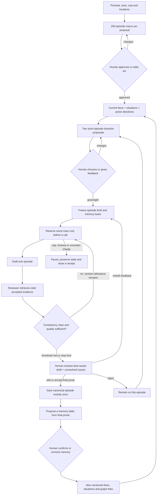
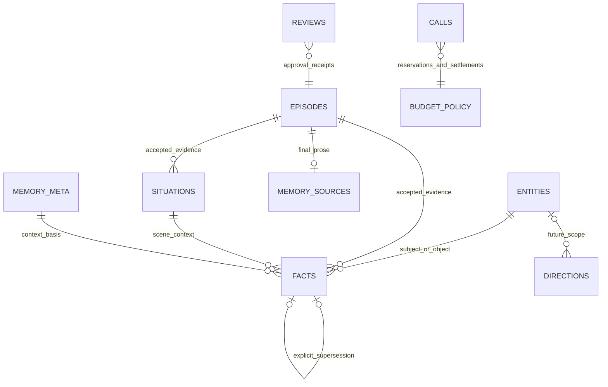

# Framework: serial writing with visible, source-linked memory

## One sentence
A human directs the future; accepted prose records the past; an inspectable ledger connects the two without confusing them.

## What is implemented and what is proposed
Implemented offline: registry, approved fixture plan, fake drafting, edit/accept/reject, idempotent acceptance, durable manual fact proposals and confirmation, accepted-source situations, explicit later fact replacement, future directions, bounded relevant context, stale-draft acceptance refusal, accounting, CLI queries and a saved read-only graph.
Proposed, not implemented: actual model gateway, detailed episode alternatives/greenlight, writer/critic revision loop, automatic digestion, complete entity/knowledge/thread/timeline extraction, editable web storyboard, conversational modification, historical repair and parallel alternatives. The fixture is not the eventual real demo.

## Story shape before any detailed episode
- Maximum 30 named characters. Maximum 10 major characters INCLUDING one protagonist, with the other 20 available as supporting roles. A writer should not fill every slot merely to meet a count.
- An episode normally concentrates on 5-10 active characters. The selected-cast interface enforces a maximum of 10, not semantic detection of all names in prose. Fewer is permitted for an intimate scene; discuss before treating five as a hard minimum.
- A small human-approved location registry. The exact count and places are still a creative decision. The model cannot automatically promote an invented setting into this registry.
- A full 200-episode macro arc: beginning, major reversals, stakes, character journeys, backstory reveal windows, open questions and an intended destination. Detailed episode beats are expanded just in time, not 200 expensive drafts up front.
- Example STRUCTURAL bands, not a chosen story: 1-30 establish the world and central question; 31-70 deepen alliances and histories; 71-110 expose a major reversal; 111-150 force consequences and competing loyalties; 151-180 converge key threads; 181-200 resolve the main promise and final choices. Boundaries remain editable intentions.
- Each major character has an author-facing background, current goal, knowledge boundary, relationships and a proposed transformation. Planned backstory reveals are not events or knowledge already established in the narrative.

No premise or actual overarching plot is selected here. Writing one before choosing the premise/genre would fabricate the missing creative decision. The current plan remains 200 placeholder beats, not this developed macro arc.

## Proposed overall flow

The overall future pipeline must stop after canonical acceptance until digestion has a review/coverage receipt. That completeness gate is a proposed addition; this manual ledger prototype does not yet enforce it. A human accepting prose is not automatically proof every important fact was captured.

## Database, not a second graph database
The graph is a VIEW of relational records in SQLite. It does not maintain separate truth.

ER relationships express application concepts; review target_kind/target_id are polymorphic audit references rather than foreign keys, and MEMORY_META is a version counter rather than a literal per-fact FK. Situations are source-linked human annotations. The legacy facts.situation_id column is protected by application checks plus an insertion trigger; object/subject/source IDs have foreign keys. A future explicit migration should give situation_id a declarative FK too.

## The storyboard: now versus next
| What is true now | Where the writer wants to go |
| --- | --- |
| Human-confirmed annotations of accepted prose, current status and provenance | Versioned directions, arc intentions, planned reveals and episode proposals |
| Changes require accepted later evidence and explicit replacement | Changes may be made manually or proposed conversationally and approved |
| Example: Ivo is alive, supported by episode 1 | Example: postpone romance until trust develops |

A future conversational agent proposes patches; it does not silently edit either side. A fact cannot be rewritten in the UI to contradict accepted prose. Correct an annotation with evidence, or enter an explicit historical-retcon workflow.

## Memory policy at episode 150
Durable on disk: every accepted prose revision, fact history, approved identities/locations, situations, relationships, knowledge, timeline events, open/resolved threads, source-linked chapter/arc summaries, plans/directions and call/review receipts.
In context: current macro-arc band, the approved episode brief, active directions, relevant character facts/knowledge/relationships, involved places, due threads, a rolling accepted-history digest and optional recent prose. Retrieve older evidence by stable IDs or indexed queries only when needed. Record every included and omitted source and budget the tokenized prompt.

Implemented NOW: confirmed relevant fact slots + applicable directions + premise/fixture beat, before up to two recent accepted prose blocks. Essential context overflow refuses rather than dropping facts silently. Context receipts include fact/direction IDs, memory/history basis and selected cast. The bound is characters, not actual model tokens. If no cast is selected, all confirmed current facts are considered, which can overflow as the story grows. Manual incompleteness, untyped predicate synonyms, chronological flashbacks and missing thread/summary tracking still prevent claiming episode-150 consistency.

Each implemented property is a single-value slot per entity and predicate. For multi-valued knowledge/relationships, a future typed schema is preferable; do not hide distinct claims under one generic knows slot. Supersession currently uses narrative episode order and evidence position, not a validated in-world timeline.

## Reviewer and quality loop, constrained by USD 1
Recommendation for the first REAL demo: two short direction alternatives, one draft, one critic, at most one automatic rewrite. Sequential, not parallel. The eventual reviewer returns evidence links plus contradicted/supported/unknown findings; unknown is not a pass. A model rating and typed JSON are advisory, not consistency guarantees.
Fixed rubric initially: continuity, causal logic, momentum, hook, prose specificity and character/setting discipline. Version every rubric. Adaptive learning from the human's preferences is version 2, not silently trained during the demo.
Stop on: quality target, maximum rewrites, maximum calls, episode cost cap, project remaining funds, unresolved charges or no improvement. Persist the best candidate and reasons for stopping. Reaching a cost stop does not make a flawed draft acceptable; hand it back with unresolved issues.
Reserve finishing capacity for human redraft and digestion before spending it all on criticism. All planning, drafting, review, revision, memory stages and retries consume the same budget. Network timeouts keep their worst-case reservation until reconciled. No assumed free cache or invisible paid fallback.
The current tested USD 1 ceiling aggregates all stages and episodes within ONE ledger/database. A real adapter must use a single shared project accounting ledger across every story/demo database, otherwise creating another database would create a fresh allowance. There is no real provider path today. The per-episode fake limit remains USD 0 and three calls. This is accounting-interface evidence, not a provider-side billing guarantee.

## Historical episode-40 edit
Proposed conservative workflow: save a new accepted-history branch/revision after explicit human confirmation, invalidate dependent facts/summaries and episode 41 onward for repair review, rebuild memory from the revised accepted prefix, replan/review affected episodes, then promote the reviewed continuation. Keep old versions and receipts. An automatic selective dependency repair is unsafe until extraction coverage is measured.
Implemented today: changing already accepted prose is refused; explicit later fact development is supported; memory/direction changes prevent stale pending-draft acceptance. No 41-60 repair or rewind is implemented.

## Framework and product path
Plain Python + SQLite keeps the transaction, retry and authority rules visible. A graph-shaped workflow does not require LangGraph or Neo4j. If workflow branching later justifies LangGraph, keep the domain services and relational canon; add durable checkpoints and stable run/thread IDs, with side effects separated from interrupted/resumed nodes. No framework switch now.
V1: explainable CLI workflow plus local read-only graph. Next bounded choices: approved macro-arc editing, episode direction proposals, shared budget ledger and a real provider adapter after access/pricing approval. V2: editable storyboard, conversation-driven proposed patches, preference-aware evaluations, selective historical repair and parallel candidate comparison.
A personal-website demo is a later destination. No website edits, uploads, public repo, deploy, publication or assignment submission is authorized by this design.
