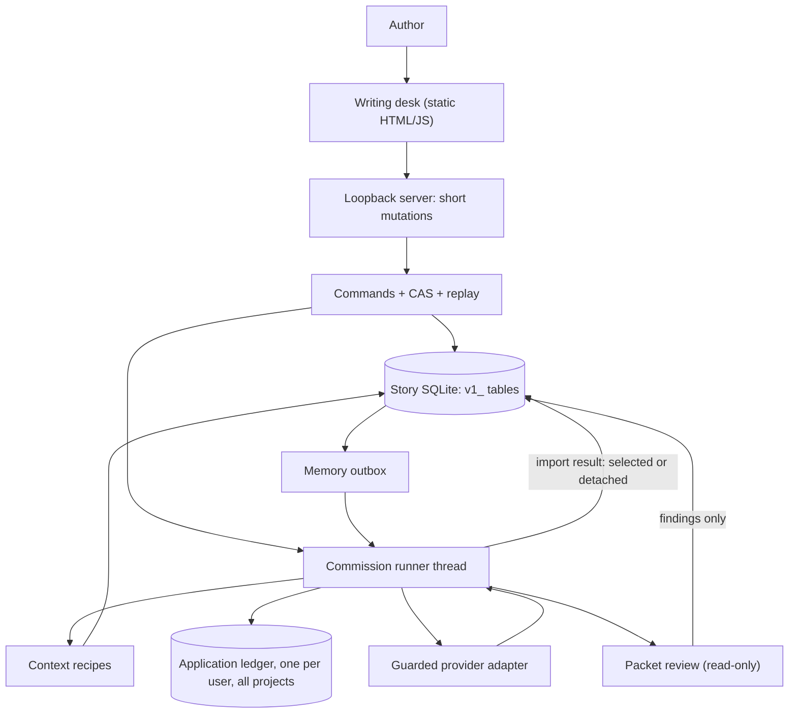
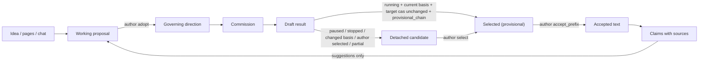
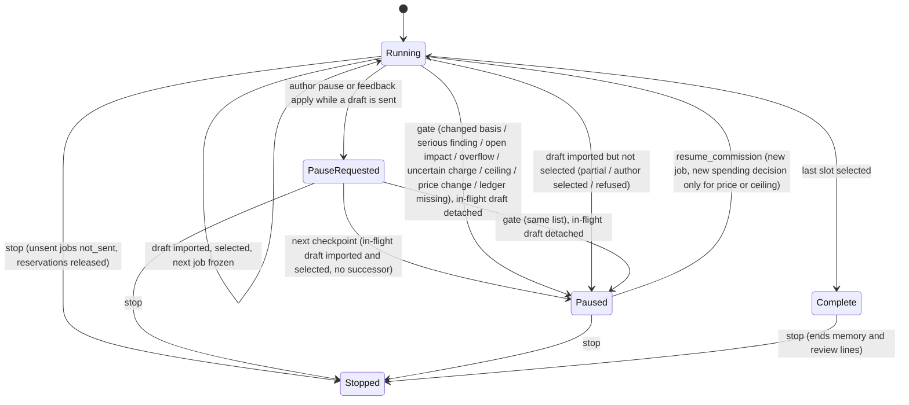
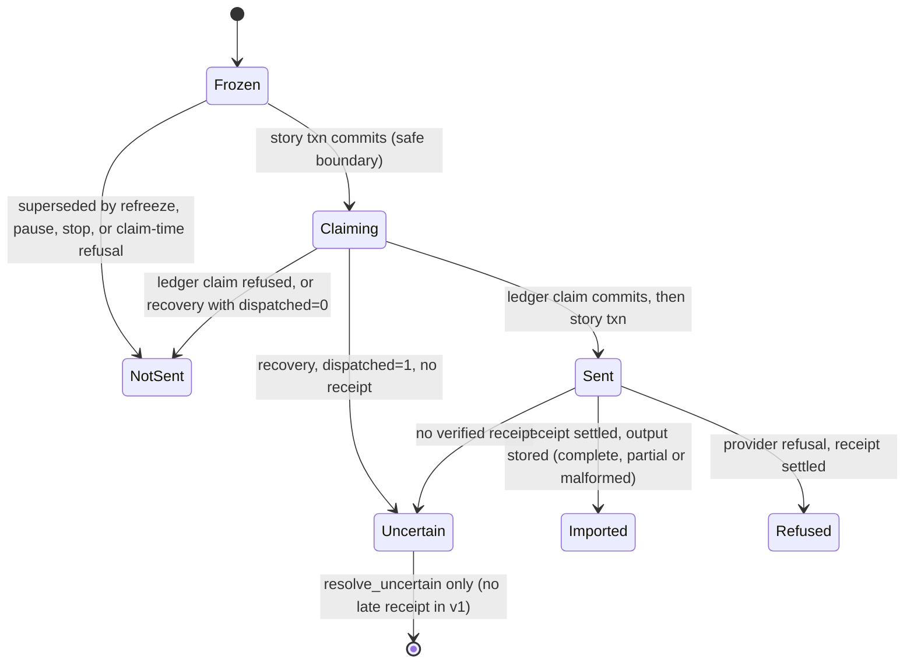
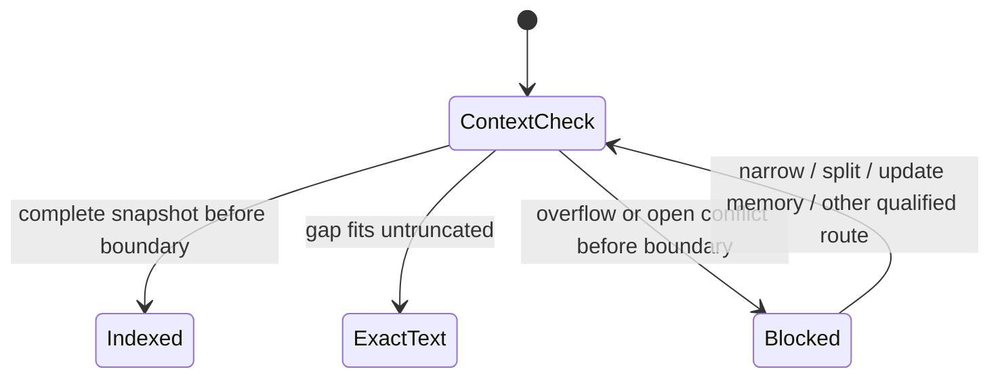

# V1 diagrams and writing-desk contract

**2026-10-02 · Revision 3 (spec-fix of `REVIEW-FINDINGS.md` and `OWNER-DECISIONS.md`; log in `SPEC-FIX-LOG.md`).** The state and sequence diagrams below follow 02 §3 exactly; where they disagree, 02 §3 wins. Mermaid is inspected as text, not rendered. This describes intended behavior for the writing desk and the fixture; it does not assert that the fixture currently behaves this way. A separate worker is revising the fixture from the same critiques; its changes are unreviewed here. Backend HOLD remains.

Companions: [workflow and journey J0–J10](01-WORKFLOW-CONTRACTS.md), [data and context](02-DATA-INGESTION-CONTEXT.md), [implementation plan](04-IMPLEMENTATION-PLAN.md).

## 1. System and authority



Only commands write pointers or canon. The runner writes results, provisional selections under commission authority, findings and claims. Review and promotion never write prose or canon.



## 2. States

```mermaid
stateDiagram-v2
    [*] --> Exploring
    Exploring --> Proposed: save proposal
    Proposed --> Exploring: discuss
    Proposed --> Adopted: author adopts exact revision
    Adopted --> Adopted: brainstorm; pointer unchanged
    Adopted --> Superseded: author adopts successor; impact flagged
```





`PauseRequested` is `status=running` with `pause_requested` set (02 §2); it is drawn as its own state only for clarity. While `Paused` or `Complete`, memory and review lines still dispatch (02 §3 "Gates by job line").





## 3. Commission with conversation and upstream edit (J3, J4, J6)

```mermaid
sequenceDiagram
    actor A as Author
    participant O as Commands
    participant S as Story DB
    participant R as Runner
    participant L as Ledger
    participant P as Provider
    A->>O: commission_arc(S1, A1, E1–E3, ceiling, provisional_chain, memory)
    O->>S: commission + frozen E1 job
    R->>L: reserve E1 (sum ≤ ceiling, ≤ cap)
    R->>S: job claiming (safe boundary)
    R->>L: claim_dispatch
    R->>S: job sent
    R->>P: E1 exchange (no locks held)
    P-->>R: E1 text + accounting
    R->>L: settle
    R->>S: import E1, select (commission), freeze E2 from E1 r1
    A->>O: converse on E1; mark "use for remaining"
    O->>S: feedback, "not used by E2", pause_requested=feedback (status stays running)
    R->>P: E2 exchange
    P-->>R: E2
    R->>S: import E2, select (running, basis current, E2 cas unchanged), then checkpoint pauses (feedback), no E3 job
    Note over A,S: J5 rewrite/undo on E1 happens here (§4). E2 flagged at E1 r3. Author revalidates E2 r1 against E1 r5
    A->>O: resume_commission
    O->>S: freeze E3 from E1 r5 + E2 r1 with feedback, same ceiling, new job
    R->>P: E3 exchange
    A->>O: save_revision E1 (face memory)
    O->>S: E1 r6 selected, E2 flagged (basis = revalidation to r5), commission paused (gate)
    P-->>R: late E3 r1 (made from E1 r5)
    R->>L: settle (charge kept)
    R->>S: store E3 r1 detached (basis_changed), no successor
    R->>S: review line runs during pause, finding on E2 vs E1 r6 (street name)
    A->>O: request_repair E2 (own quote)
    R->>S: repair candidate for E2 (never selected by itself)
    A->>O: apply_candidate → E2 r2 (basis E1 r6), then resume_commission
    R->>S: E3 r2 from E1 r6 + E2 r2, selected
```

## 4. Block rewrite, unrelated edit and undo (J5)

```mermaid
sequenceDiagram
    actor A as Author
    participant O as Commands
    participant S as Story DB
    A->>O: request_rewrite(E1, block b1 [0,212), polish)
    O->>S: candidate; affected blocks b1 (+ b0, b2 context) with hashes
    A->>O: apply_candidate
    O->>S: all affected hashes unchanged → E1 r3, event e7 (before/after b1)
    A->>O: save_revision edits block b9 only
    O->>S: E1 r4; lineage b1 same
    A->>O: revert_event(e7)
    alt b1 in r4 equals e7 after-image
        O->>S: E1 r5 restores b1; b9 edit survives
    else b1 changed since e7
        O-->>A: before / AI / now comparison; nothing written
    end
```

Redo uses e7's stored after-image under the mirror check. Neither calls a model.

## 5. Acceptance, memory and return (J7–J10)

```mermaid
sequenceDiagram
    actor A as Author
    participant O as Commands
    participant S as Story DB
    participant R as Runner
    A->>O: accept_prefix([E1 r6, E2 r2, E3 r2], canon_seq=0)
    O->>S: one txn with story ordinals 1–3, sources, canon, acceptance, outbox (authorized via commission memory line)
    O-->>A: accepted; memory updating
    R->>S: lease task; exact canon source
    R->>S: claims + snapshot, or failure kept
    A->>O: prepare_context(arc_planning, after E3)
    O-->>A: indexed or exact-text receipt, or blocked with reasons
    A->>O: stage_change_set(E1, E2) weeks later
    O->>S: staged, old canon still governs, no impacts yet
    A->>O: commit_change_set(canon_seq=1)
    O->>S: new canon E1/E2 at ordinals 1, 2, claims superseded by status, snapshot invalidated, E3 flagged, tasks awaiting_authority
```

## 6. Writing-desk contract

**Outcome:** the author shapes direction and prose, commissions linked drafts in one decision, and always knows which words are final.

**Surface:** an editable writing desk, reading-first, using `.stitch/DESIGN.md` tokens (palette, bundled IBM Plex Sans, tabular numerals for counts and money, motion tokens). The graph is an optional evidence lens. The signature element is the **Evidence Spine**: passage → reading → next context.

### Hierarchy and contextual disclosure

The desk shows one dominant action for the current checkpoint and keeps engineering detail on demand. Persona runs found competing blue actions, version identities in place of prose, and disclosure sections that collapsed after use.

| Always visible | One click away | Only when relevant |
| --- | --- | --- |
| Manuscript, governing direction label ("Following S1 · A1, episode 2 of 3"), conversation composer, suggestions | History, alternatives, sources, claims, commission details, costs | Pause reason with its resolution actions; overflow items; uncertain charge; withdrawn style evidence; changed-since-selected marks |

Plain words replace internal terms in author-facing copy: "made from an older version of episode 1" instead of "stale basis"; "memory updating; using exact accepted pages" instead of "fallback"; "not sent" and "result unknown, charge held" for ledger states. Hashes appear only inside an expandable "exact versions" detail.

### Intended behavior adopted from persona critiques

These are specification decisions, not observations of the current fixture.

1. **Commission choice.** The arc screen offers "Continue through the arc using each draft provisionally" and "Pause for me to choose each draft", with the ceiling and included memory/review lines in one summary. Author decision count for J3 is one, versus one selection per episode.
2. **Truthful rewrite scope.** The active candidate shows its scope, reason and basis together, separate from controls for creating a new candidate. A whole-episode repair is labelled whole episode, with changed passages highlighted.
3. **Readable acceptance.** Accept shows each episode's prose inline (or a diff against the selected version) and a "changed since selected" mark, with the button labelled "Accept E1–E3, these versions".
4. **Undo beside the edit.** Each applied rewrite shows Undo next to it. After undo the candidate reads "undone" with restored text. Refusal details stay open, show the full current block and offer "Keep current" or explicit resolution.
5. **Conversation without duplication.** A message has "Use for next proposal / rewrite / remaining episodes"; there is no separate feedback form to retype into. The active scope sits beside that action. On phones, a fixed compact conversation control is always reachable.
6. **Suggestions protect drafts.** With a nonempty composer, a suggestion offers append or replace-with-undo.
7. **Reading boundaries.** Every claim shows its exact span and revision link. Planned or unaccepted reveals never appear beside accepted memory; they are labelled "planned" in the arc.
8. **Honest style evidence.** Evidence types read "I wrote this", "I chose this generated line", "I asked for this", with before/after shown, and the author picks which items support a note.
9. **Recovery stays open.** Disclosure sections the author opened stay open across local actions, and focus returns to a visible control.
10. **Phone order.** Compared words come before the request form.

### Action → command

| UI action | Command | Effect |
| --- | --- | --- |
| Paste pages / ask / write freely | `ingest`, `converse`, `save_revision` | Sources, messages, exploratory revisions |
| Adopt / edit and adopt | `save_revision`, `adopt` | Governing pointer |
| Choose arc length | `propose_arc`, `adopt` | Arc revision, episode artifacts |
| Commission / pause / resume / stop | `commission_arc`, `pause_commission`, `resume_commission`, `stop_commission` | Jobs, provisional selections; never acceptance |
| Use message for next | `mark_feedback` | Scoped feedback |
| Choose a take | `select` | Selection pointer, downstream flags |
| Rewrite / apply / undo / redo | `request_rewrite`, `apply_candidate`, `revert_event`, `redo_event` | Candidate or block-scoped revision |
| Repair / revalidate | `request_repair` then `apply_candidate`, `revalidate` | Candidate (applied by the author) or receipt |
| Undo any reversible action | `revert_event` | Per 01 §4 "Reversibility"; terminal actions show no Undo |
| Accept | `accept_prefix` | Story ordinals, canon, outbox; length warning asks for a short reason outside 550–900 words |
| Correct a reading / resolve a finding | `interpret`, `resolve_finding` | Claim revision or resolution |
| Revise accepted pages | `stage_change_set`, `commit_change_set` | New canon on commit |
| Voice note | `propose_style`, `adopt_style`, `retire_style`, `revert_style` | Style revision and evidence |
| Settle an unknown charge | `resolve_uncertain` | Conservative spend |

## 7. States, access and motion

| State | Behavior |
| --- | --- |
| Empty | Idea, pages, question or write-now entry; no wizard |
| Loading / in flight | Text and selection kept; "Drafting episode 2" static status; no fake progress |
| Unsaved | Local versus saved text distinct; kept on error and navigation |
| Paused | One sentence reason plus its resolution actions |
| Detached result | "Made from an older version"; compare, keep or discard; charge shown |
| Uncertain charge | "Result unknown, charge held"; resolve conservatively; no retry |
| Ceiling reached | Reading, conversation composition and manual writing remain; model replies also cost |
| Memory updating | Accepted text intact; exact-text mode disclosed; overflow lists items |

Keyboard: native controls, skip link, visible focus, Escape closes and returns focus, arrivals never steal the cursor. Narrow layout: single task column, governing label, episode selector, conversation and source as sheets; 44 px targets; meaning never by colour alone.

Motion (tokens only): press `instant` 80 ms transform; receipts and side panels `fast` 160 ms opacity; candidate or pause arrival `base` 240 ms opacity, once per event. No motion on reading text, no auto-pan, no typing effects. Reduced motion leaves opacity changes instant.

## 8. Browser evidence status

Observed so far (frozen fixture `6D599039…`): reduced-motion 390×844 runs completed (planner R3, discovery R and S). Desktop 1440×900 video runs timed out (planner R1 at 150 s, discovery M at 120 s) with observations recorded but no finalized pass; planner R2 stopped at a hidden undo control. Simulated personas are not human research, and worker success is not UX clearance. The acceptance matrix for the revised fixture and for the later real desk is 04 §8.
